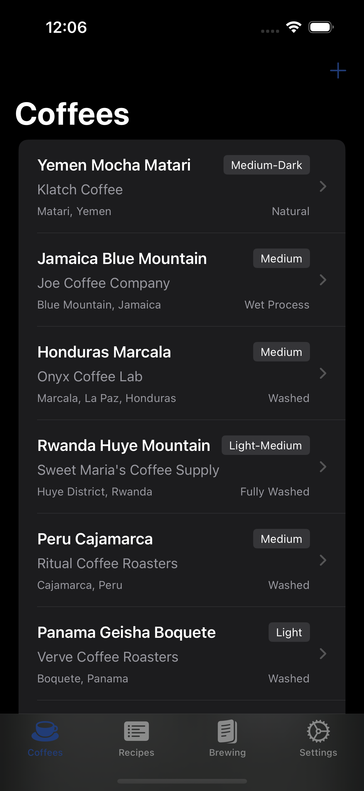
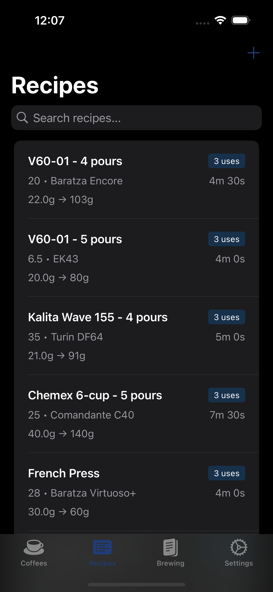
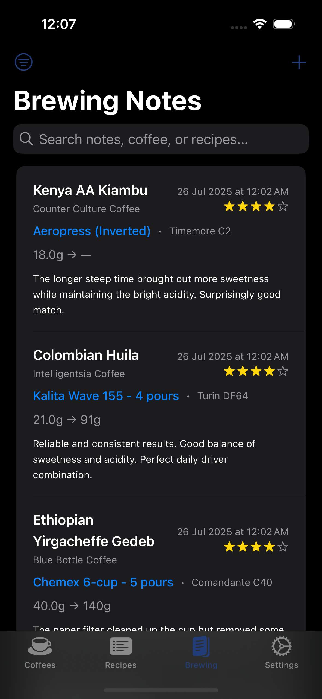
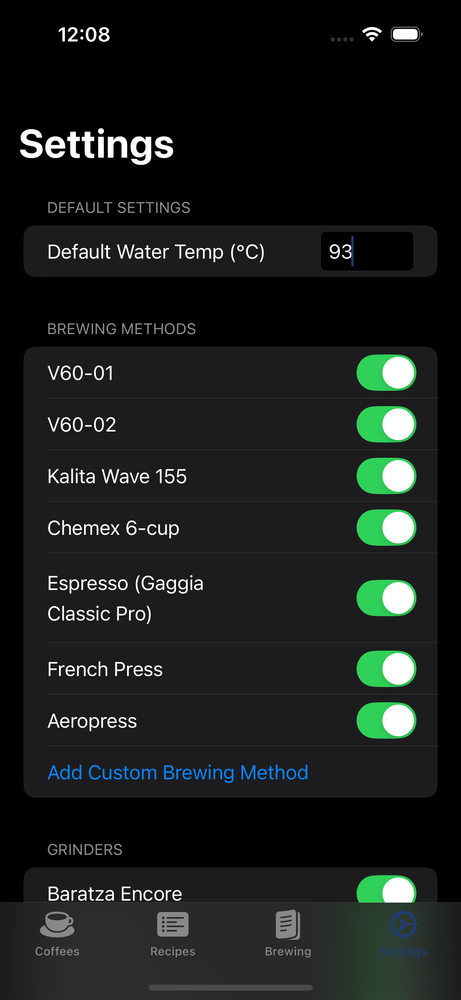

# ☕ Kofi Kofi iOS App

[](https://developer.apple.com/ios/)
[](https://swift.org)
[](https://developer.apple.com/xcode/swiftui/)
[](#testing)

A comprehensive iOS app for coffee enthusiasts to track brewing experiments, manage coffee inventory, and maintain detailed brewing notes with a 5-star rating system.

## 📱 Screenshots

<div align="center">
<table>
<tr>
<td><br/><b>Coffee Collection</b></td>
<td><br/><b>Brewing Recipes</b></td>
</tr>
<tr>
<td><br/><b>Brewing Notes</b></td>
<td><br/><b>Settings Menu</b></td>
</tr>
</table>
</div>

## ✨ Features

### 📦 Coffee Management
- **Inventory tracking** with detailed coffee attributes (name, roaster, origin, processing method, roast level)
- **Smart search and filtering** across your coffee collection
- **Automatic date tracking** for when coffees were added to your collection

### 📝 Recipe Management  
- **Method-specific brewing recipes** with dynamic forms that adapt to your brewing method
- **Dynamic pour scheduling** - Start with 2 pours and add more as needed with Add/Remove buttons
- **Supported brewing methods** (fully customizable):
  - **V60 (01, 02)**: Multi-stage pour scheduling with bloom timing
  - **Kalita Wave (155)**: Controlled pour-over brewing
  - **Chemex (6-cup)**: Large batch pour-over
  - **Espresso (Gaggia Classic Pro)**: Machine-specific water ratios
  - **French Press**: Simplified bloom + steeping workflow
  - **Aeropress**: Normal/Inverted with plunge timing
  - **Custom Methods**: Add your own brewing equipment
- **Enhanced recipe cards** with improved time formatting (mins:secs) and dose → final weight display
- **Logical field ordering** - Brew time positioned as final parameter for intuitive form flow
- **Usage-based sorting** (most-used recipes appear first)
- **Streamlined Equipment section** combines brewing method and grinder selection

### 🎯 Brewing Sessions & Notes
- **Comprehensive session details** - View complete brewing information with coffee, recipe, and notes in one place
- **Optimized detail view** - All session information fits on one screen without scrolling for improved usability
- **View-first navigation** - Tap sessions to see detailed brewing information before editing
- **Complete coffee information** - Name, roaster, origin, processing method, and roast level
- **Full recipe display** - Method-specific parameters, timing, and pour schedules
- **Native sharing functionality** - Share brewing sessions as high-resolution images with coffee and recipe details
- **iOS share sheet integration** - Share to social media, messaging, email, or save to photos
- **Flexible pairing** of any coffee with any recipe
- **Detailed tasting notes** - with rich text input and 5-star rating system
- **Easy editing** - Edit button in detail view provides quick access to modify sessions
- **Automatic recipe usage tracking** for intelligent sorting

### 📊 Brewing Analytics & History
- **Space-optimized detail views** - Comprehensive brewing session information displayed efficiently on one screen
- **Advanced search capabilities** across coffee names, recipe names, brewing methods, and notes
- **Rating-based filtering** (1-5 stars or show all sessions)
- **Visual star ratings** with intuitive display
- **Streamlined navigation** - View details first, edit when needed
- **Complete session management** - View, edit, delete, and organize your brewing data
- **Unified interface** - All brewing activities consolidated into one tab

### ⚙️ Equipment Preferences
- **Customizable equipment lists** - enable/disable based on your actual gear
- **Personal equipment setup** pre-configured for popular gear (Baratza Encore, Turin DF64, 1Zpresso J-Ultra, etc.)
- **Custom equipment support** - add your own brewing methods and grinders
- **Smart validation** prevents disabling all equipment
- **Configurable defaults** like preferred water temperature
- **Proper measurement units** (grams, °Celsius, seconds)

## 🏗️ Technical Architecture

### Core Technologies
- **SwiftUI** - Modern declarative UI framework
- **Core Data** - Robust local data persistence with CloudKit-ready architecture
- **MVVM Pattern** - Clean separation of concerns
- **XCTest** - Comprehensive testing suite

### Data Models
- **Coffee** - Bean inventory with origin and processing details
- **Recipe** - Brewing parameters with method-specific attributes  
- **BrewingNote** - Session records linking coffee + recipe with ratings
- **ProcessingMethod** - Smart autocomplete for coffee processing methods

### Code Quality Features
- **Centralized brewing method detection** - Single source of truth for method validation
- **Safe Core Data accessors** - Nil-safe property handling throughout
- **Reusable UI components** - StarRatingView, FormFieldView for consistency
- **Comprehensive test coverage** - 47 unit tests + 10 UI tests including dynamic pour functionality and sharing features
- **Recent refactoring** - 30% reduction in code duplication

## 🚀 Getting Started

### Prerequisites
- iOS 17.0+
- Xcode 15.0+  
- Swift 5.0+

### Installation
1. Clone the repository
```bash
git clone https://github.com/yourusername/kofi-kofi.git
cd kofi-kofi
```

2. Open in Xcode
```bash
open CoffeeBrewingNotes.xcodeproj
```

3. Build and run on simulator or device (`⌘+R`)

### Usage
1. **Configure your equipment** in Settings - enable your brewing methods and grinders
2. **Add coffee beans** to build your inventory  
3. **Create brewing recipes** using your preferred methods
4. **Manage brewing sessions** in the unified Brewing tab - create new sessions or edit existing ones
5. **Track and refine** - Tap any session to edit details and improve your technique over time

## 🧪 Testing

### Test Coverage
- **Unit Tests**: 47 tests covering data models, extensions, brewing note editing, and business logic
- **UI Tests**: 10 end-to-end tests for critical user workflows including unified brewing interface and sharing functionality
- **All tests passing** with stable, reliable execution

### Running Tests
```bash
# Run all tests
xcodebuild test -scheme CoffeeBrewingNotes -destination 'platform=iOS Simulator,name=iPhone 16,OS=latest'

# Or use Xcode
# ⌘+U to run all tests
```

## 📁 Project Structure

```
CoffeeBrewingNotes/
├── CoffeeBrewingNotesApp.swift    # App entry point
├── ContentView.swift              # Main UI (consolidated architecture)
├── Persistence.swift              # Core Data stack
├── PreferencesManager.swift       # Equipment preferences system
├── Models/
│   ├── CoffeeBrewingNotes.xcdatamodeld
│   ├── Coffee+Extensions.swift
│   ├── Recipe+Extensions.swift    # Centralized brewing method detection
│   ├── BrewingNote+Extensions.swift
│   └── ProcessingMethod+Extensions.swift
└── Views/
    ├── SimpleCoffeeListView.swift # Active coffee management component
    ├── StarRatingView.swift       # Reusable star rating components
    └── FormFieldView.swift        # Reusable form field components
```

## 🔮 Future Enhancements

- **Photo attachments** for coffee bags and results
- **AI powered data loading** from pics of coffee bags
- **iCloud sync** for cross-device access
- **Export functionality** (PDF, CSV formats)
- **Timer integration** for brew sessions  
- **Advanced analytics** and brewing trend visualization
- **Recipe sharing** between users
- **Advanced filtering** by date ranges and brewing parameters
- **Enhanced sharing options** with custom templates and branding

## 🤝 Contributing

We welcome contributions! Please see our [Developer Documentation](DEVELOPER_DOCS.md) for detailed development guidelines.

### Development Notes
- **UI Architecture**: Main UI consolidated in `ContentView.swift` due to Xcode build target limitations
- **Method Detection**: Use centralized `Recipe` static methods for consistency
- **File Creation**: Avoid creating new Swift files - they're difficult to add to Xcode project targets
- **Testing**: Maintain the stable test suite when making changes

## 📄 License

This project is licensed under the MIT License - see the [LICENSE](#license) section below for details.

```
MIT License

Copyright (c) 2025 Kofi Kofi

Permission is hereby granted, free of charge, to any person obtaining a copy
of this software and associated documentation files (the "Software"), to deal
in the Software without restriction, including without limitation the rights
to use, copy, modify, merge, publish, distribute, sublicense, and/or sell
copies of the Software, and to permit persons to whom the Software is
furnished to do so, subject to the following conditions:

The above copyright notice and this permission notice shall be included in all
copies or substantial portions of the Software.

THE SOFTWARE IS PROVIDED "AS IS", WITHOUT WARRANTY OF ANY KIND, EXPRESS OR
IMPLIED, INCLUDING BUT NOT LIMITED TO THE WARRANTIES OF MERCHANTABILITY,
FITNESS FOR A PARTICULAR PURPOSE AND NONINFRINGEMENT. IN NO EVENT SHALL THE
AUTHORS OR COPYRIGHT HOLDERS BE LIABLE FOR ANY CLAIM, DAMAGES OR OTHER
LIABILITY, WHETHER IN AN ACTION OF CONTRACT, TORT OR OTHERWISE, ARISING FROM,
OUT OF OR IN CONNECTION WITH THE SOFTWARE OR THE USE OR OTHER DEALINGS IN THE
SOFTWARE.
```

---

**Note**: This project includes code generated with AI assistance ([Claude](https://claude.ai)).

## ⭐ Show Your Support

If you find this project helpful, please consider giving it a star! It helps others discover the project and motivates continued development.
